# ⚽ WELCOME TO MY ULTIMATE TEAM ⚽

[![LinkedIn][linkedin-shield]][linkedin-url]
[![Personal Website][website-shield]][website-url]
[![Email][email-shield]][email-url]
[![Resume][resume-shield]][resume-url]

 

<!-- ⭐ THE CARD ⭐ -->

### 99 OVR · SWE · Right-Footed Keyboard 🎯

*"If it's working, don't touch it 😉"* — Manager's note

## 🎮 Player Bio

> - 🎓 **Current Club:** State University of New York at Buffalo — M.S. Computer Science *(Jan 2025 – May 2026)*
> - 🏟️ **Youth Academy:** Amrita Vishwa Vidyapeetham — B.Tech CSE
> - 🔄 **Loan Spells:** Backend Engineer Intern @ **Trianz** · SWE Intern @ **NIT Warangal**
> - ⚡ **Playstyle:** High-concurrency backends, production ML pipelines, real-time systems
> - 💬 **Press Conferences:** Ask me about anything — I'll try my best to help
> - 📫 **Agent Contact:** tarunbadana22@gmail.com

## 📊 Attributes

**⚙️ Languages**

&nbsp;
&nbsp;
&nbsp;
&nbsp;
&nbsp;

**🛡️ Backend & Frameworks**

&nbsp;
&nbsp;
&nbsp;
&nbsp;
&nbsp;

**🗄️ Databases & Cloud**

&nbsp;
&nbsp;
&nbsp;
&nbsp;
&nbsp;
&nbsp;

**🧠 ML & AI**

&nbsp;
&nbsp;
&nbsp;
&nbsp;

**🔧 Kit & Tools**

&nbsp;
&nbsp;
&nbsp;

## 🏆 Season Stats

## 📝 Transfer Inquiries Open

**Scouting for a backend/ML engineer who ships?**
📫 **tarunbadana22@gmail.com** · [LinkedIn][linkedin-url] · [Portfolio][website-url]

⭐ *Card animates on profile — watch the shimmer* ⭐

[linkedin-shield]: https://img.shields.io/badge/-LinkedIn-black.svg?style=for-the-badge&logo=linkedin&colorB=555
[linkedin-url]: https://www.linkedin.com/in/tarun-badana-60942923a/
[website-shield]: https://img.shields.io/badge/Website-000000?style=for-the-badge&logo=About.me&logoColor=white
[website-url]: https://tarunbad.netlify.app
[email-shield]: https://img.shields.io/badge/Email-D14836?style=for-the-badge&logo=gmail&logoColor=white
[email-url]: mailto:tarunbadana22@gmail.com
[resume-shield]: https://img.shields.io/badge/Resume-4285F4?style=for-the-badge&logo=google-drive&logoColor=white
[resume-url]: https://drive.google.com/file/d/1hN8wdRYTZrsgfYX-OCuOY_LBpVvGdZA3/view?usp=share_link
